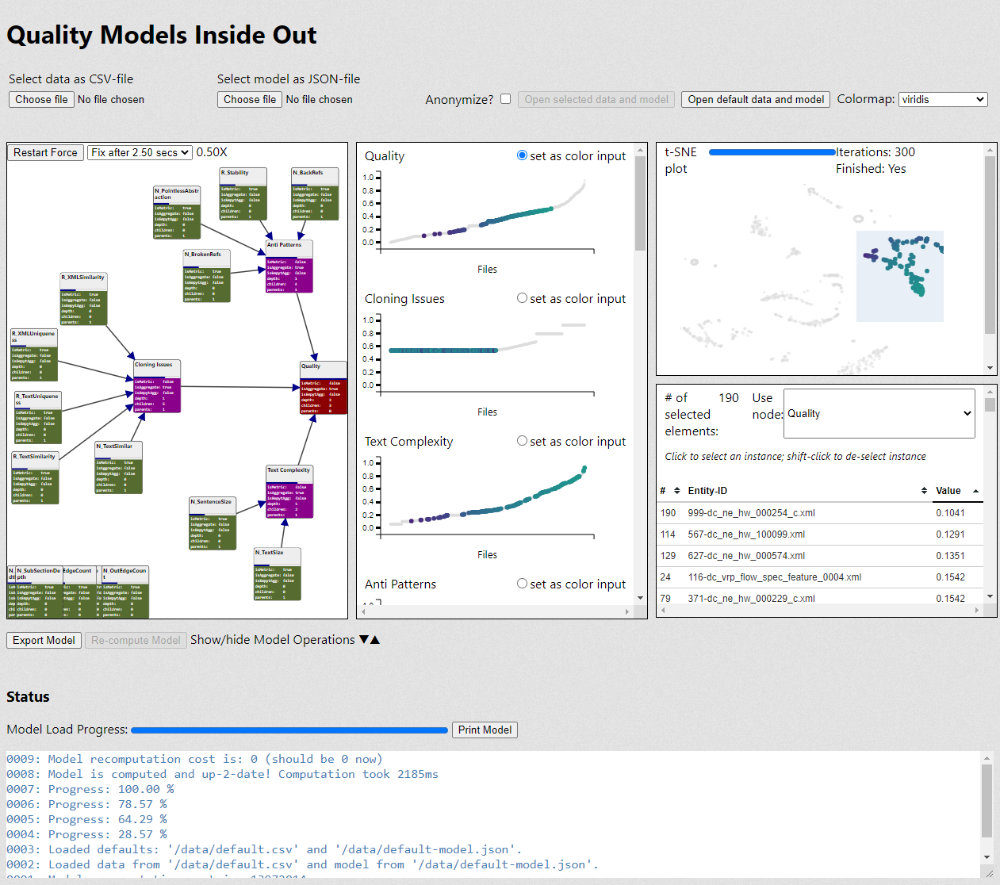

Artifact: Quality Models Inside Out: Interactive Visualization of Software Metrics by Means of Joint Probabilities
======

This is the artifact for the paper of the same name, presented at the 6th IEEE Working Conference on Software Visualization (VISSOFT 2018), Madrid, Spain, 24-25 September 2018, <https://doi.org/10.1109/VISSOFT.2018.00015>.

The tool can be installed locally **or** you may download a ready-to-run virtual machine: <https://doi.org/10.5281/zenodo.1311601>

